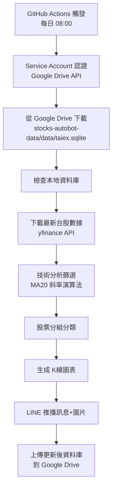

# 台股推薦機器人 (Stocks Autobot)


每天台北時間 **08:00** 自動執行，提供台股技術分析推薦，透過 LINE 推播文字訊息和 K 線圖表。

## 🎯 核心功能

### 📊 智能選股系統
- **技術指標分析**：20日移動平均線 (MA20) 斜率計算
- **多重過濾條件**：
  - 連續5日開盤價與收盤價均高於MA20
  - MA20斜率 < 1（避免過熱股票）
  - 波動率 < 3%（降低風險）
  - 與MA20距離控制（動態調整）

### 🏷️ 雙組分類推薦
- **💪 好像蠻強的**：MA20斜率 0.5-1（強勢上升趨勢）
- **👀 有機會噴 觀察一下**：MA20斜率 < 0.5（潛力標的）

### 📈 視覺化圖表
- **K線圖生成**：2×3 網格佈局，每組最多6支股票
- **技術指標疊加**：MA20移動平均線
- **90日歷史數據**：提供充足的技術分析基礎
- **圖片自動上傳**：Telegraph/Catbox 多重備援，無需API key

### 📱 LINE 整合
- **文字推薦訊息**：包含股票代碼和中文名稱
- **圖表推送**：高清K線圖直接傳送到LINE
- **無推薦時通知**：市場條件不符時的友善提醒

## 🚀 自動化流程



## 🔧 設定指南

### 1. LINE Developers 設定
1. 至 [LINE Developers](https://developers.line.biz/) 建立 Provider
2. 建立 **Messaging API channel**
3. 取得 **Channel access token**（長效）
4. 將機器人加為好友，取得 **User ID**

### 2. Google Drive 設定（推薦）
1. 建立 GCP 專案，啟用 **Google Drive API**
2. 建立 **Service Account** 並下載 JSON 金鑰
3. 建立 Google Drive 資料夾 `stocks-autobot-data`
4. 將資料夾分享給 Service Account email（編輯者權限）
5. 程式會自動在 `stocks-autobot-data` 下建立 `data` 子資料夾存放 `taiex.sqlite`

### 3. GitHub Secrets 設定
在 Repository → Settings → Secrets and variables → Actions 新增：

| Secret Name | 說明 | 必需 |
|-------------|------|------|
| `LINE_CHANNEL_ACCESS_TOKEN` | LINE Messaging API 的 Channel access token | ✅ |
| `LINE_USER_ID` | 接收推播的使用者 ID | ✅ |
| `GDRIVE_SERVICE_ACCOUNT` | Service Account JSON 完整內容 | 🔶 推薦 |

### 4. 環境變數自訂（可選）
在 `.github/workflows/daily.yml` 中可設定：
- `TWSE_CODES`：自訂股票代碼清單（預設100支台股）
- `TOP_K`：選股數量上限（預設100）

## 📊 支援股票清單

目前支援 **100支台股** 包括：
- **電子股**：台積電(2330)、鴻海(2317)、聯發科(2454)、廣達(2382)...
- **金融股**：富邦金(2881)、國泰金(2882)、兆豐金(2886)、中信金(2891)...
- **傳產股**：台塑(1301)、中鋼(2002)、台化(1326)、統一(1216)...
- **航運股**：長榮(2603)、陽明(2609)、萬海(2615)...

完整清單請參考 `main.py` 中的 `STOCK_NAMES` 字典。

## 🏃‍♂️ 快速開始

1. **Fork 此專案**到你的 GitHub 帳號
2. **設定 Secrets**（參考上方設定指南）
3. **手動測試**：GitHub Actions → 選擇 `daily-picks` → Run workflow
4. **檢查 LINE**：確認收到推薦訊息和圖表
5. **等待每日自動執行**：每天 08:00 會自動運行

## 📁 專案結構

```
stocks-autobot/
├── main.py                    # 主要執行程式
├── test_line.py               # 本地測試版本（含 Google Drive OAuth）
├── requirements.txt           # Python 套件依賴
├── data/                      # 資料庫檔案（與 Google Drive 同步）
│   └── taiex.sqlite          # 股價歷史資料
├── .github/
│   └── workflows/
│       └── daily.yml         # GitHub Actions 自動化流程
└── README.md                 # 專案說明
```

## 🔬 技術架構

- **資料來源**：Yahoo Finance API (yfinance)
- **資料庫**：SQLite（本地快取，避免重複下載）
- **圖表生成**：matplotlib + 自製 K線圖函數
- **圖床服務**：Telegraph、Catbox（無需API key）
- **訊息推播**：LINE Messaging API
- **雲端同步**：Google Drive API + Service Account
- **自動化**：GitHub Actions
- **認證方式**：Google Service Account（JSON Key）

## 📈 演算法說明

### 篩選條件
1. **趨勢檢查**：連續5日開盤價與收盤價均高於MA20
2. **斜率控制**：MA20斜率 < 1（避免過熱）
3. **波動率限制**：5日收盤價標準差 < 3%
4. **距離控制**：與MA20距離在合理範圍內

### 分組邏輯
- **好像蠻強的組**：斜率 ∈ [0.5, 1)，代表穩健上升趨勢
- **有機會噴 觀察一下組**：斜率 < 0.5，代表潛力標的

### 優化機制
當某組股票 > 6支時：
1. 優先排除5日最低收盤價股票
2. 選擇與MA20距離最近的6支股票

## 🛠️ 本地開發

```bash
# 複製專案
git clone https://github.com/your-username/stocks-autobot.git
cd stocks-autobot

# 安裝依賴
pip install -r requirements.txt

# 設定環境變數
cp .env.example .env
# 編輯 .env 檔案填入必要資訊

# 本地測試（含 Google Drive 功能）
python test_line.py

# 雲端版本測試（僅 LINE 推播）
python main.py
```

## 📝 更新日誌

### v2.1.0 (2024-12-29)
- 🔐 整合 Google Drive Service Account API 直接存取
- ⚡ 移除 rclone 依賴，改用原生 Google Drive API
- 📁 自動建立 `stocks-autobot-data/data/` 資料夾結構
- 🔄 智能資料同步：僅在資料更新時上傳到 Google Drive
- 📋 簡化 GitHub Actions workflow 設定

### v2.0.0 (2024-12-29)
- ✨ 新增雙組分類推薦系統
- 📊 K線圖表自動生成和推送
- 🎯 升級為100支台股支援
- 🔍 導入 MA20 斜率技術分析
- 🖼️ 多重圖床備援機制

### v1.0.0
- 🚀 基礎選股推薦功能
- 📱 LINE 推播整合
- ☁️ Google Drive 同步
- ⚡ GitHub Actions 自動化

## 🤝 貢獻指南

歡迎提交 Issue 和 Pull Request！

1. Fork 專案
2. 建立功能分支 (`git checkout -b feature/new-feature`)
3. 提交更改 (`git commit -am 'Add new feature'`)
4. 推送分支 (`git push origin feature/new-feature`)
5. 建立 Pull Request

## 📄 授權

MIT License - 詳見 [LICENSE](LICENSE) 檔案

## ⚠️ 免責聲明

本專案僅供學習和研究使用，不構成任何投資建議。投資有風險，請謹慎評估。

---

Made with ❤️ for Taiwan Stock Market