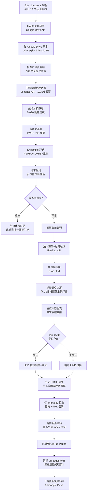

# Qtrading — 台股每日選股機器人 (Taiwan Stock Screener)


## Overview (English)

Qtrading is a fully automated daily stock-screening pipeline for the Taiwan stock market (1,000+ listed tickers). Every trading day at 18:00 Taipei time, a GitHub Actions workflow downloads the latest market data and screens stocks through a three-stage funnel:

1. **Momentum screen** — MA20-based trend and volatility rules
2. **Fundamental filter** — P/E screening via TWSE OpenAPI
3. **Technical ensemble** — 4-signal vote (RSI / MACD / Bollinger Bands / volume)

Picks are enriched with institutional chip data (FinMind API), rendered as candlestick charts, pushed to LINE subscribers, and published as a static report site on GitHub Pages. SQLite synced to Google Drive preserves 90 days of price history between CI runs; the codebase is modular (19 modules) with 41 unit tests gating deployment.

**Live demo:** [yanshuopan.github.io/Qtrading](https://yanshuopan.github.io/Qtrading/) — full documentation below is in Traditional Chinese.

---

每天台北時間 **18:00** 自動執行，提供台股技術分析推薦，透過 LINE 推播文字訊息和 K 線圖表，並自動發布到 GitHub Pages 網頁展示。

📊 **[查看線上展示頁面](https://yanshuopan.github.io/Qtrading/)** (範例)

⭐ **最新特色**：多維度選股系統（基本面 + 法人籌碼 + AI 情緒 + 多策略 Ensemble）、**延續觀察追蹤**、GitHub Pages 展示頁面、智能歷史資料歸檔、LINE 通知。

## 🎯 核心功能

### 📊 智能選股系統
- **動能選股策略**：20日移動平均線 (MA20) 斜率計算
- **多重過濾條件**：
  - 近 10 日均量 > 1000 張（排除冷門股）
  - 連續5日開盤價與收盤價均高於MA20
  - MA20斜率 < 1（避免過熱股票）
  - 波動率 < 5%（降低風險）
  - 近 10 日振幅均值 > 1 元（確保操作空間）
  - 與MA20距離控制（動態調整）

### 📈 多策略 Ensemble 評分
4 個技術指標投票，判斷個股多空強弱：
- **RSI(14)**：40-70 區間為看多（健康上升）
- **MACD**：Histogram > 0 為看多（正向動能）
- **布林通道**：收盤價 > 中軌為看多
- **量能**：5 日均量 > 20 日均量為看多（量增）
- 結果顯示 `X/4 策略看好`，3/4 以上視為強勢

### 🏦 基本面篩選（TWSE OpenAPI）
- **本益比 (P/E)**：過濾 P/E > 50（高估）與 P/E ≤ 0（虧損）
- **殖利率 / 股價淨值比**：顯示於報告 badge 供參考

### 💰 法人籌碼分析（FinMind API）
- **外資 / 投信**：近 10 日淨買賣超張數
- **連續買超**：法人連買 ≥ 3 日特別標示
- **融資融券**：融資餘額連減 ≥ 3 日標示（洗盤信號）

### 🤖 AI 情緒分析（Groq API）
- 使用 `llama-3.3-70b-versatile` 模型分析 Google News 新聞標題
- 判斷每個熱門題材的市場情緒：bullish / bearish / neutral
- 顯示於熱門題材股報告中

> **註**：此功能目前預設停用（模組保留於 `modules/sentiment.py`，設定 `GROQ_API_KEY` 後可重新啟用）。

### 🔄 延續觀察追蹤
- **昨日延續觀察**：前一交易日推薦股票的今日狀態評估
- **前日延續觀察**：前兩個交易日推薦股票的狀態追蹤
- **MA20 檢查**：近 5 日開收均價是否仍在 MA20 之上
- **Ensemble 重新評分**：即時重新計算 4 策略投票結果
- **狀態標示**：「仍符合」（持續多頭）/「已轉弱」（跌破 MA20）
- **去重機制**：今日已選中的股票不重複出現在延續觀察中

### 🏷️ 雙組分類推薦
- **前100大交易量能**：高流動性標的
- **其餘**：中小型潛力股

### 📈 視覺化圖表
- **K線圖生成**：2×3 網格佈局，每組最多6支股票
- **技術指標疊加**：MA20移動平均線
- **90日歷史資料**：保留3個月完整技術分析基礎
- **跨平台中文字體**：支援 Windows/Linux 環境中文顯示
- **自動儲存**：圖表自動暫存並內嵌至 HTML 報告

### 📱 LINE 整合
- **多用戶訂閱系統**：支援多位用戶同時接收推播
  - 資料庫管理訂閱者清單
  - 支援啟用/停用訂閱狀態
  - 批量推送訊息與圖表
- **LINE 通知開關**：透過 `line_id.txt` 控制是否發送 LINE 訊息
  - 檔案存在時發送通知
  - 檔案不存在時跳過通知（方便測試與除錯）
- **文字推薦訊息**：包含股票代碼和中文名稱
- **圖表推送**：高清K線圖直接傳送到LINE
- **智能週末檢測**：股市休市日（週六/日）自動跳過訊息
- **無推薦時通知**：市場條件不符時的友善提醒

### 🌐 GitHub Pages 展示
- **每日推薦頁面**：自動生成精美的 HTML 展示頁面
  - 響應式設計，支援手機與桌面瀏覽
  - 顯示股票代碼、中文名稱與 K 線圖
  - 自動顯示日期與星期幾
- **智能歷史管理**：
  - 主頁保留最近 7 天的推薦資料
  - 超過 7 天的資料自動歸檔至 `archive/` 資料夾
  - 歸檔頁面獨立索引，方便查閱歷史資料
- **即時更新**：每日執行後自動部署到 GitHub Pages

### 🐛 除錯與監控
- **DEBUG_MODE**：詳細執行日誌與錯誤追蹤
- **Google Drive 狀態監控**：上傳下載進度詳細記錄
- **GitHub Actions 文件保存**：自動收集除錯日誌與圖片
- **rclone 日誌上傳**：失敗或成功都保存完整日誌供除錯

## 🚀 自動化流程


```mermaid
graph TD
    A[GitHub Actions 觸發<br/>每日 18:00 台北時間] --> B[OAuth 2.0 認證<br/>Google Drive API]
    B --> C[從 Google Drive 同步<br/>taiex.sqlite & line_id.txt]
    C --> D[檢查本地資料庫<br/>保留90天歷史資料]
    D --> E[下載最新台股數據<br/>yfinance API - 1033支股票]
    E --> F[技術分析篩選<br/>MA20 動能選股]
    F --> F2[基本面過濾<br/>TWSE P/E 篩選]
    F2 --> F3[Ensemble 評分<br/>RSI+MACD+BB+量能]
    F3 --> G[週末檢測<br/>股市休市時跳過]
    G --> H{是否為週末?}
    H -->|週末| I[記錄休市日誌<br/>跳過推播與網頁生成]
    H -->|平日| J[股票分組分類]
    J --> J2[法人籌碼+融資融券<br/>FinMind API]
    J2 --> J3[AI 情緒分析<br/>Groq LLM]
    J3 --> J4[延續觀察追蹤<br/>前1-2日推薦股重新評估]
    J4 --> K[生成 K線圖表<br/>中文字體支援]
    K --> L{line_id.txt<br/>是否存在?}
    L -->|存在| M[LINE 推播訊息+圖片]
    L -->|不存在| N[跳過 LINE 推播]
    M --> O[生成 HTML 頁面<br/>含 K線圖與股票清單]
    N --> O
    O --> P[從 gh-pages 拉取<br/>歷史 HTML 檔案]
    P --> Q[合併新舊資料<br/>重新生成 index.html]
    Q --> R[部署到 GitHub Pages]
    R --> S[清理 gh-pages 分支<br/>歸檔超過7天資料]
    S --> T[上傳更新後資料庫<br/>到 Google Drive]
```

## 🔧 設定指南

### 1. LINE Developers 設定
1. 至 [LINE Developers](https://developers.line.biz/) 建立 Provider
2. 建立 **Messaging API channel**
3. 取得 **Channel access token**（長效）
4. 將機器人加為好友，取得 **User ID**

### 2. Google Drive OAuth 2.0 設定（推薦）
1. 建立 GCP 專案，啟用 **Google Drive API**
2. 建立 **OAuth 2.0 憑證** 並下載 JSON 檔案
3. 建立 Google Drive 資料夾（例如：`stocks-autobot-data`）
4. **取得資料夾 ID**：
   - 開啟 Google Drive 資料夾
   - 從網址列複製資料夾 ID（如：`1Oyn-Zuiswh-mUL7G4dKwjLoZfwUk9e_f`）
   - 設定為 GitHub Secret: `GOOGLE_DRIVE_FOLDER_ID`
5. 程式會自動在指定資料夾下建立 `data` 子資料夾存放 `taiex.sqlite`

### 3. Service Account 備援設定（可選）
如果 OAuth 2.0 失效，可設定 Service Account 作為備援：
1. 建立 **Service Account** 並下載 JSON 金鑰
2. 將資料夾分享給 Service Account email（編輯者權限）
3. 設定為 GitHub Secret: `GDRIVE_SERVICE_ACCOUNT`

💡 **認證優先順序**：OAuth 2.0 → Service Account → 跳過雲端同步

### 4. GitHub Pages 設定（可選）
如果想要網頁展示功能：
1. 前往 Repository → Settings → Pages
2. Source 選擇 **Deploy from a branch**
3. Branch 選擇 **gh-pages** → **/ (root)**
4. 儲存後等待部署完成
5. 訪問 `https://<your-username>.github.io/<repo-name>/` 查看推薦頁面

### 5. GitHub Secrets 設定
在 Repository → Settings → Secrets and variables → Actions 新增：

| Secret/Variable Name | 說明 | 類型 | 必需 |
|---------------------|------|------|------|
| `LINE_CHANNEL_ACCESS_TOKEN` | LINE Messaging API 的 Channel access token | Secret | ✅ |
| `LINE_USER_ID` | 接收推播的使用者 ID（單一用戶） | Secret | ✅ |
| `GDRIVE_CLIENT_ID` | Google OAuth 2.0 Client ID | Secret | ✅ |
| `GDRIVE_CLIENT_SECRET` | Google OAuth 2.0 Client Secret | Secret | ✅ |
| `GDRIVE_TOKEN_JSON` | Google OAuth 2.0 Token JSON（含 refresh_token） | Secret | ✅ |
| `GDRIVE_ROOT_FOLDER_ID` | Google Drive 同步目標資料夾 ID | Secret | 🔶 推薦 |
| `EXTRA_USER_IDS` | 額外的訂閱者 LINE User IDs（逗號分隔） | Secret | 🔷 可選 |
| `GROQ_API_KEY` | Groq AI API Key（用於情緒分析，`gsk_` 開頭） | Secret | 🔷 可選 |
| `FINMIND_API_TOKEN` | FinMind API Token（用於法人籌碼/融資融券） | Secret | 🔷 可選 |
| `DEBUG_MODE` | 啟用詳細除錯日誌 (`true`/`false`) | Variable | 🔷 可選 |

#### 如何取得 rclone OAuth Token：
1. 在本地執行 `rclone config` 設定 Google Drive
2. 完成 OAuth 授權流程
3. 從 `~/.config/rclone/rclone.conf` 複製 token JSON
4. 將整段 JSON（包含 `access_token` 和 `refresh_token`）設為 `GDRIVE_TOKEN_JSON`

### 6. LINE 通知開關控制
透過 `line_id.txt` 檔案控制是否發送 LINE 推播：
- **開啟通知**：在 Google Drive 根目錄放置 `line_id.txt` 檔案（可為空檔案）
- **關閉通知**：刪除 Google Drive 中的 `line_id.txt` 檔案
- 這個功能方便在測試或除錯時暫時關閉 LINE 通知，但仍然執行選股與網頁生成

### 7. 環境變數自訂（可選）
在 `.github/workflows/daily.yml` 中可設定：
- `TWSE_CODES`：自訂股票代碼清單（預設1033支台股）
- `TOP_K`：選股數量上限（預設1033）
- `DEBUG_MODE`：除錯模式，收集詳細日誌和錯誤資訊

## 📊 支援股票清單

目前支援 **1033支台股** 包括：
- **電子股**：台積電(2330)、鴻海(2317)、聯發科(2454)、廣達(2382)、聯電(2303)、日月光投控(3711)...
- **金融股**：富邦金(2881)、國泰金(2882)、兆豐金(2886)、中信金(2891)、玉山金(2884)、元大金(2885)...
- **傳產股**：台塑(1301)、中鋼(2002)、台化(1326)、統一(1216)、台泥(1101)、南亞(1303)...
- **航運股**：長榮(2603)、陽明(2609)、萬海(2615)、裕民(2606)、台驊控股(2636)...
- **其他產業**：涵蓋水泥、食品、塑膠、紡織、電機、化學、生技、觀光、金融、百貨等各類股

完整清單請參考 [modules/stock_codes.py](modules/stock_codes.py) 中的 `STOCK_NAMES` 字典，包含上市櫃主要公司。

## 🏃‍♂️ 快速開始

1. **Fork 此專案**到你的 GitHub 帳號
2. **設定 Secrets**（參考上方設定指南）
3. **啟用 GitHub Pages**（可選，若要網頁展示功能）
4. **手動測試**：GitHub Actions → 選擇 `daily-picks` → Run workflow
5. **檢查結果**：
   - 確認 LINE 收到推薦訊息和圖表（若有開啟通知）
   - 訪問 GitHub Pages 查看網頁展示（若有啟用）
6. **等待每日自動執行**：每天 18:00 台北時間會自動運行

## 📁 專案結構

```
Qtrading/
├── main.py                       # 主要執行程式
├── generate_historical_data.py   # 歷史資料生成工具（用於測試或補資料）
├── generate_index_standalone.py  # 獨立的 index.html 生成器（用於 gh-pages）
├── webhook_app.py                # LINE Webhook 伺服器（處理用戶訂閱）
├── modules/                      # 模組化架構
│   ├── __init__.py              # 套件初始化
│   ├── config.py                # 配置管理
│   ├── logger.py                # 日誌系統
│   ├── database.py              # 資料庫操作（訂閱者管理）
│   ├── google_drive.py          # Google Drive 整合
│   ├── line_messaging.py        # LINE 訊息推送
│   ├── stock_codes.py           # 股票代碼管理（1033支股票）
│   ├── stock_data.py            # 股價資料處理與動能選股策略
│   ├── fundamentals.py          # TWSE 基本面篩選（P/E、殖利率、P/B）
│   ├── finmind_data.py          # FinMind 法人籌碼 / 融資融券
│   ├── sentiment.py             # Groq AI 情緒分析
│   ├── strategies.py            # 多策略 Ensemble（RSI/MACD/BB/量能）
│   ├── continuation.py          # 延續觀察追蹤（前日推薦股重新評估）
│   ├── breakout_detector.py     # 破底翻（C 型態）偵測
│   ├── pool.py                  # 觀察池管理（14 日追蹤 + 族群熱度）
│   ├── sector_heat.py           # 族群熱度計算
│   ├── hot_stocks_sync.py       # 熱門題材股同步（讀取標籤系統資料）
│   ├── hot_stocks_generator.py  # 熱門題材股生成（RSS/PTT/Anue 爬蟲）
│   ├── visualization.py         # K線圖表生成
│   └── html_generator.py        # GitHub Pages HTML 生成器（含多維 badge）
├── tests/                        # 單元測試
│   ├── __init__.py
│   ├── test_strategies.py       # Ensemble 策略測試
│   ├── test_stock_data.py       # 選股邏輯測試
│   └── test_pool.py             # 觀察池模組測試
├── requirements.txt              # Python 套件依賴
├── taiex.sqlite                  # 股價歷史資料（與 Google Drive 同步）
├── line_id.txt                   # LINE 通知開關（存在=開啟，不存在=關閉）
├── .github/
│   └── workflows/
│       └── daily.yml            # GitHub Actions 自動化流程
└── README.md                    # 專案說明
```

## 🔬 技術架構

### 核心技術棧
- **程式語言**：Python 3.11+
- **資料來源**：Yahoo Finance API (yfinance)、TWSE OpenAPI、FinMind API
- **AI 分析**：Groq API（llama-3.3-70b-versatile 情緒分析）
- **資料庫**：SQLite（本地快取，避免重複下載）
- **圖表生成**：matplotlib + 自製 K線圖函數
- **訊息推播**：LINE Messaging API
- **雲端同步**：Google Drive API (rclone)
- **網頁展示**：GitHub Pages (靜態 HTML)
- **自動化**：GitHub Actions (每日 18:00 台北時間執行)
- **認證方式**：OAuth 2.0 with refresh token

### 模組化架構
專案採用模組化設計，將功能分離成獨立模組：
- **config.py**：集中管理所有環境變數與配置
- **logger.py**：統一的日誌記錄系統
- **database.py**：資料庫操作（含多用戶訂閱管理）
- **google_drive.py**：Google Drive 檔案同步
- **line_messaging.py**：LINE 訊息廣播與多用戶推送
- **stock_codes.py**：1033支股票代碼與名稱管理
- **stock_data.py**：股價下載與動能選股策略
- **fundamentals.py**：TWSE 基本面數據擷取與篩選
- **finmind_data.py**：FinMind 法人籌碼與融資融券數據
- **sentiment.py**：Groq AI 新聞情緒分析
- **strategies.py**：多策略 Ensemble 投票系統（RSI/MACD/BB/量能）
- **continuation.py**：延續觀察追蹤（解析前日推薦、重新評估 MA20 + Ensemble）
- **breakout_detector.py**：破底翻（C 型態）偵測
- **pool.py**：觀察池管理（14 日追蹤 + 族群熱度變化）
- **sector_heat.py**：族群熱度計算（細產業分類）
- **hot_stocks_sync.py**：熱門題材股同步（讀取標籤系統 CSV）
- **hot_stocks_generator.py**：熱門題材股生成（Google News RSS / PTT / Anue 爬蟲）
- **visualization.py**：K線圖表繪製（MA10/MA20 可切換）
- **html_generator.py**：GitHub Pages HTML 頁面生成（每日推薦頁、索引頁、歸檔頁）

## 📈 演算法說明

### 第一關：動能選股
1. 近 10 日均量 > 1000 張（排除冷門股）
2. 連續5日開收均價高於MA20（多頭趨勢）
3. MA20斜率 < 1（避免過熱）
4. 波動率 < 5%（降低風險）
5. 近 10 日 high-low 均值 > 1 元（確保振幅）
6. 與MA20距離在合理範圍內

### 第二關：基本面過濾
- 排除 P/E > 50（過度高估）或 P/E ≤ 0（虧損公司）
- 無 P/E 資料者放行（不因缺資料誤殺）

### 第三關：Ensemble 評分
4 策略投票，每個看多得 1 票：
| 信號 | 看多條件 |
|------|---------|
| RSI(14) | 40 ≤ RSI ≤ 70 |
| MACD | Histogram > 0 |
| 布林通道 | 收盤價 > 中軌 |
| 量能 | 5 日均量 > 20 日均量 |

### 分組邏輯
- **前100大交易量能**：MA20 斜率 < 0.7 的高流動性股
- **其餘**：MA20 斜率 < 0.7 的中小型潛力股
- 每組最多 6 支

### 輔助資訊（不影響篩選）
- **法人籌碼**：外資/投信淨買賣、連續買超天數
- **融資融券**：融資連減天數（洗盤信號）
- **AI 情緒**：Groq LLM 分析新聞標題判斷題材多空

## 🛠️ 本地開發

```bash
# 複製專案
git clone https://github.com/YanShuoPan/Qtrading.git
cd Qtrading

# 安裝依賴
pip install -r requirements.txt

# 設定環境變數：在專案根目錄建立 .env 檔案，
# 填入必要的 API 金鑰（項目參考上方「GitHub Secrets 設定」表格）

# 執行單元測試
python -m pytest tests/

# 完整流程測試
python main.py
```

## 🧰 工具腳本

### `generate_historical_data.py` - 歷史資料生成工具
用於生成過去 N 天的歷史測試資料（含 HTML 頁面與 K 線圖）：

```bash
# 生成過去 7 天的資料（預設）
python generate_historical_data.py

# 生成過去 30 天的資料
python generate_historical_data.py 30
```

**功能說明**：
- 自動跳過週末（股市休市日）
- 為每一天執行選股、生成圖表、建立 HTML 頁面
- 更新首頁 index.html 包含所有歷史日期
- 適合用於測試 GitHub Pages 功能或補充缺失的歷史資料

### `generate_index_standalone.py` - 獨立索引頁生成器
在 gh-pages 分支中使用的獨立腳本，用於重新生成首頁：

```bash
python generate_index_standalone.py
```

**功能說明**：
- 掃描當前目錄所有 HTML 檔案（排除 index.html）
- 自動解析日期並排序（最新的在前）
- 生成包含日期與星期幾的索引頁
- GitHub Actions workflow 會自動使用此腳本

### `webhook_app.py` - LINE Webhook 伺服器
處理 LINE 用戶的訂閱與退訂請求（需部署到公開伺服器）：

```bash
# 本地測試（需要設定 ngrok 或其他隧道工具）
python webhook_app.py
```

**功能說明**：
- 處理 LINE Bot 的 Webhook 事件
- 支援加好友自動訂閱、封鎖自動退訂
- 將訂閱資料同步到資料庫與 Google Drive
- 需要公開 HTTPS 端點才能接收 LINE 的 Webhook

## 📝 更新日誌

### v4.2.0 (2026-06-09)
- 🧹 **程式碼品質大掃除**：
  - 移除死碼：刪除 `image_upload.py` 模組及 6 個未使用的 import
  - 統一時區：所有時間操作改用 `TPE_TZ`（UTC+8），取代 `datetime.utcnow()` / `date.today()`
  - 效能優化：5 處 `iterrows` 改為向量化操作（`str.contains`、`groupby`、`executemany`、`np.where`）
  - 合併重複：`plot_stock_charts` + `plot_breakout_charts` → 統一 `plot_charts(ma_period=)`
  - 統一 logger：全模組改用 `get_logger(__name__)`
  - 修正比較：浮點數 `==` → `abs() < 1e-9`、`== False` → `~`
  - CI 強化：測試步驟移除 `continue-on-error`，測試失敗即中止部署
- 🧪 **新增測試**：`test_stock_data.py`（10 tests）、`test_pool.py`（7 tests），共 41 tests

### v4.1.0 (2025-05-19)
- 🔄 **延續觀察追蹤**：自動追蹤前 1-2 個交易日推薦股票的最新狀態
  - 重新評估 MA20 位置與 Ensemble 4 策略投票
  - 「仍符合」/「已轉弱」狀態標示，一目了然
  - 自動排除今日已選中的股票，避免重複
  - 含完整法人籌碼、融資融券等多維 badge
- 🧹 **專案清理**：移除多餘開發文件，精簡倉庫結構

### v4.0.0 (2025-05-18)
- 🧠 **多策略 Ensemble 系統**：RSI + MACD + 布林通道 + 量能 4 策略投票評分
- 🏦 **基本面篩選**：整合 TWSE OpenAPI，自動取得 P/E、殖利率、P/B 並過濾
- 💰 **法人籌碼分析**：整合 FinMind API，顯示外資/投信淨買賣、連續買超
- 📊 **融資融券信號**：融資餘額連減偵測（洗盤信號）
- 🤖 **AI 情緒分析**：整合 Groq API（llama-3.3-70b），分析新聞標題判斷題材多空
- 🏷️ **HTML 多維 badge**：股票卡片顯示基本面、籌碼、Ensemble 評分
- 🧪 **單元測試**：新增 24 個 Ensemble 策略測試
- ⚙️ **CI 更新**：GitHub Actions 加入測試步驟與新 Secrets 支援

### v3.2.0 (2025-01-17)
- 🌐 **GitHub Pages 展示功能**：自動生成精美的推薦展示頁面
  - 響應式設計，支援手機與桌面瀏覽
  - 自動顯示日期與星期幾
  - 包含股票代碼、名稱與 K 線圖
- 📦 **智能歷史資料歸檔**：自動管理歷史資料
  - 主頁保留最近 7 天的推薦資料
  - 超過 7 天的資料自動歸檔至 `archive/` 資料夾
  - 歸檔頁面獨立索引，方便查閱歷史紀錄
- 🔔 **LINE 通知開關功能**：透過 `line_id.txt` 控制推播
  - 檔案存在時發送 LINE 通知
  - 檔案不存在時跳過通知（方便測試與除錯）
  - 不影響選股與網頁生成功能
- 🐛 **修復 GitHub Actions 衝突問題**
  - 修復 `rclone.log` 檔案在分支切換時的衝突
  - 改進 `index.html` 提交邏輯，確保包含最新日期
  - 優化 gh-pages 分支清理流程

### v3.1.0 (2025-01-02)
- 🏗️ **模組化重構**：將 1320 行主程式拆分為 10 個獨立模組
  - 主程式從 1320 行精簡至 213 行（減少 84%）
  - 提升程式碼可維護性與可讀性
  - 每個模組職責單一，便於測試與擴展
- 👥 **多用戶訂閱系統**：支援多位 LINE 用戶同時接收推播
  - 資料庫新增 `subscribers` 表管理訂閱者
  - 支援從環境變數批量匯入訂閱者
  - 向下相容單一用戶 `LINE_USER_ID` 設定
- ⏱️ **GitHub Actions 超時保護**：防止 workflow 卡住
  - 加入 `timeout-minutes` 步驟級別超時（5分鐘）
  - rclone 操作超時設定（--timeout 30s, --contimeout 60s）
  - 自動重試機制（--retries 3, --low-level-retries 3）
  - 新增 rclone 連接測試步驟
- 🔄 **rclone 整合優化**：改用 rclone 取代原生 Google Drive API
  - 更穩定的檔案同步機制
  - 支援 OAuth 2.0 with refresh token
  - 詳細的同步日誌記錄

### v3.0.0 (2024-12-30)
- 🚀 **擴展至1033支台股**：涵蓋上市櫃主要公司完整覆蓋
- 🔐 **OAuth 2.0 認證**：取代 Service Account 成為主要認證方式
- 📴 **智能週末檢測**：股市休市日自動跳過 LINE 訊息推送
- 🐛 **DEBUG_MODE**：詳細除錯日誌與 GitHub Actions 文件收集
- 🔍 **Google Drive 監控**：上傳下載狀態詳細記錄
- 🎨 **跨平台中文字體**：Windows/Linux 環境完美支援中文顯示
- 📅 **90天資料保留**：確保3個月技術分析圖表完整性

### v2.1.0 (2024-12-29)
- 🔐 整合 Google Drive Service Account API 直接存取
- ⚡ 移除 rclone 依賴，改用原生 Google Drive API
- 📁 自動建立 `stocks-autobot-data/data/` 資料夾結構
- 🔄 智能資料同步：僅在資料更新時上傳到 Google Drive
- 📋 簡化 GitHub Actions workflow 設定

### v2.0.0 (2024-12-29)
- ✨ 新增雙組分類推薦系統
- 📊 K線圖表自動生成和推送
- 🎯 升級為100支台股支援（現已擴展至1033支）
- 🔍 導入 MA20 斜率技術分析
- 🖼️ K 線圖表自動生成

### v1.0.0
- 🚀 基礎選股推薦功能
- 📱 LINE 推播整合
- ☁️ Google Drive 同步
- ⚡ GitHub Actions 自動化

## ❓ 常見問題

### Q1: 如何暫時關閉 LINE 通知但保留選股功能？
在 Google Drive 根目錄刪除 `line_id.txt` 檔案即可。程式仍會執行選股、生成圖表並部署到 GitHub Pages，但不會發送 LINE 訊息。

### Q2: 為什麼 GitHub Pages 只顯示最近 7 天的資料？
這是設計行為，主頁只保留最近 7 天的推薦資料以保持頁面簡潔。超過 7 天的資料會自動歸檔到 `archive/` 資料夾，可以透過歸檔頁面查閱完整歷史紀錄。

### Q3: 如何新增更多訂閱者？
有兩種方式：
1. **環境變數**：在 GitHub Secrets 中設定 `EXTRA_USER_IDS`（逗號分隔多個 User ID）
2. **Webhook**：部署 `webhook_app.py` 到公開伺服器，用戶加好友時自動訂閱

### Q4: 可以更改每日執行時間嗎？
可以！編輯 [.github/workflows/daily.yml](.github/workflows/daily.yml#L8) 中的 cron 排程設定。注意時區為 UTC，需要換算台北時間（UTC+8）。

### Q5: 圖表中文顯示亂碼怎麼辦？
專案已內建中文字體支援（Windows：微軟正黑體，Linux：文泉驛微米黑）。如果在本地開發遇到問題，請確認系統已安裝對應字體。

### Q6: 如何補充缺失的歷史資料？
使用 `generate_historical_data.py` 腳本：
```bash
python generate_historical_data.py 30  # 生成過去 30 天的資料
```
生成後提交到 gh-pages 分支即可。

### Q7: rclone 同步失敗怎麼辦？
檢查以下項目：
1. 確認 `GDRIVE_CLIENT_ID`、`GDRIVE_CLIENT_SECRET`、`GDRIVE_TOKEN_JSON` 正確設定
2. 檢查 token 是否包含 `refresh_token`（需要在本地用 `rclone config` 授權時取得）
3. 查看 GitHub Actions 的 rclone logs artifact 了解詳細錯誤訊息

## 🤝 貢獻指南

歡迎提交 Issue 和 Pull Request！

1. Fork 專案
2. 建立功能分支 (`git checkout -b feature/new-feature`)
3. 提交更改 (`git commit -am 'Add new feature'`)
4. 推送分支 (`git push origin feature/new-feature`)
5. 建立 Pull Request

## 📄 授權

MIT License - 詳見 [LICENSE](LICENSE) 檔案

## ⚠️ 免責聲明

本專案僅供學習和研究使用，不構成任何投資建議。投資有風險，請謹慎評估。

---

Made with ❤️ for Taiwan Stock Market