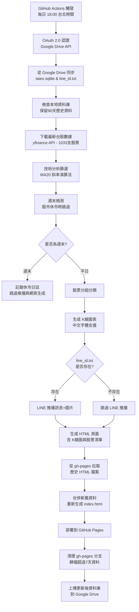

# 台股推薦機器人 (Stocks Autobot)


每天台北時間 **18:00** 自動執行，提供台股技術分析推薦，透過 LINE 推播文字訊息和 K 線圖表，並自動發布到 GitHub Pages 網頁展示。

📊 **[查看線上展示頁面](https://yanshuopan.github.io/Qtrading/)** (範例)

⭐ **最新特色**：GitHub Pages 展示頁面、智能歷史資料歸檔(保留7天)、智能週末檢測、支援 OAuth 2.0 認證與 LINE 通知開關。

## 🎯 核心功能

### 📊 智能選股系統
- **技術指標分析**：20日移動平均線 (MA20) 斜率計算
- **多重過濾條件**：
  - 連續5日開盤價與收盤價均高於MA20
  - MA20斜率 < 1（避免過熱股票）
  - 波動率 < 3%（降低風險）
  - 與MA20距離控制（動態調整）

### 🏷️ 雙組分類推薦
- **💪 好像蠻強的**：MA20斜率 0.5-1（強勢上升趨勢）
- **👀 有機會噴 觀察一下**：MA20斜率 < 0.5（潛力標的）

### 📈 視覺化圖表
- **K線圖生成**：2×3 網格佈局，每組最多6支股票
- **技術指標疊加**：MA20移動平均線
- **90日歷史資料**：保留3個月完整技術分析基礎
- **跨平台中文字體**：支援 Windows/Linux 環境中文顯示
- **圖片自動上傳**：Telegraph/Catbox 多重備援，無需API key

### 📱 LINE 整合
- **多用戶訂閱系統**：支援多位用戶同時接收推播
  - 資料庫管理訂閱者清單
  - 支援啟用/停用訂閱狀態
  - 批量推送訊息與圖表
- **LINE 通知開關**：透過 `line_id.txt` 控制是否發送 LINE 訊息
  - 檔案存在時發送通知
  - 檔案不存在時跳過通知（方便測試與除錯）
- **文字推薦訊息**：包含股票代碼和中文名稱
- **圖表推送**：高清K線圖直接傳送到LINE
- **智能週末檢測**：股市休市日（週六/日）自動跳過訊息
- **無推薦時通知**：市場條件不符時的友善提醒

### 🌐 GitHub Pages 展示
- **每日推薦頁面**：自動生成精美的 HTML 展示頁面
  - 響應式設計，支援手機與桌面瀏覽
  - 顯示股票代碼、中文名稱與 K 線圖
  - 自動顯示日期與星期幾
- **智能歷史管理**：
  - 主頁保留最近 7 天的推薦資料
  - 超過 7 天的資料自動歸檔至 `archive/` 資料夾
  - 歸檔頁面獨立索引，方便查閱歷史資料
- **即時更新**：每日執行後自動部署到 GitHub Pages

### 🐛 除錯與監控
- **DEBUG_MODE**：詳細執行日誌與錯誤追蹤
- **Google Drive 狀態監控**：上傳下載進度詳細記錄
- **GitHub Actions 文件保存**：自動收集除錯日誌與圖片
- **rclone 日誌上傳**：失敗或成功都保存完整日誌供除錯

## 🚀 自動化流程



## 🔧 設定指南

### 1. LINE Developers 設定
1. 至 [LINE Developers](https://developers.line.biz/) 建立 Provider
2. 建立 **Messaging API channel**
3. 取得 **Channel access token**（長效）
4. 將機器人加為好友，取得 **User ID**

### 2. Google Drive OAuth 2.0 設定（推薦）
1. 建立 GCP 專案，啟用 **Google Drive API**
2. 建立 **OAuth 2.0 憑證** 並下載 JSON 檔案
3. 建立 Google Drive 資料夾（例如：`stocks-autobot-data`）
4. **取得資料夾 ID**：
   - 開啟 Google Drive 資料夾
   - 從網址列複製資料夾 ID（如：`1Oyn-Zuiswh-mUL7G4dKwjLoZfwUk9e_f`）
   - 設定為 GitHub Secret: `GOOGLE_DRIVE_FOLDER_ID`
5. 程式會自動在指定資料夾下建立 `data` 子資料夾存放 `taiex.sqlite`

### 3. Service Account 備援設定（可選）
如果 OAuth 2.0 失效，可設定 Service Account 作為備援：
1. 建立 **Service Account** 並下載 JSON 金鑰
2. 將資料夾分享給 Service Account email（編輯者權限）
3. 設定為 GitHub Secret: `GDRIVE_SERVICE_ACCOUNT`

💡 **認證優先順序**：OAuth 2.0 → Service Account → 跳過雲端同步

### 4. GitHub Pages 設定（可選）
如果想要網頁展示功能：
1. 前往 Repository → Settings → Pages
2. Source 選擇 **Deploy from a branch**
3. Branch 選擇 **gh-pages** → **/ (root)**
4. 儲存後等待部署完成
5. 訪問 `https://<your-username>.github.io/<repo-name>/` 查看推薦頁面

### 5. GitHub Secrets 設定
在 Repository → Settings → Secrets and variables → Actions 新增：

| Secret/Variable Name | 說明 | 類型 | 必需 |
|---------------------|------|------|------|
| `LINE_CHANNEL_ACCESS_TOKEN` | LINE Messaging API 的 Channel access token | Secret | ✅ |
| `LINE_USER_ID` | 接收推播的使用者 ID（單一用戶） | Secret | ✅ |
| `GDRIVE_CLIENT_ID` | Google OAuth 2.0 Client ID | Secret | ✅ |
| `GDRIVE_CLIENT_SECRET` | Google OAuth 2.0 Client Secret | Secret | ✅ |
| `GDRIVE_TOKEN_JSON` | Google OAuth 2.0 Token JSON（含 refresh_token） | Secret | ✅ |
| `GDRIVE_ROOT_FOLDER_ID` | Google Drive 同步目標資料夾 ID | Secret | 🔶 推薦 |
| `EXTRA_USER_IDS` | 額外的訂閱者 LINE User IDs（逗號分隔） | Secret | 🔷 可選 |
| `DEBUG_MODE` | 啟用詳細除錯日誌 (`true`/`false`) | Variable | 🔷 可選 |

#### 如何取得 rclone OAuth Token：
1. 在本地執行 `rclone config` 設定 Google Drive
2. 完成 OAuth 授權流程
3. 從 `~/.config/rclone/rclone.conf` 複製 token JSON
4. 將整段 JSON（包含 `access_token` 和 `refresh_token`）設為 `GDRIVE_TOKEN_JSON`

### 6. LINE 通知開關控制
透過 `line_id.txt` 檔案控制是否發送 LINE 推播：
- **開啟通知**：在 Google Drive 根目錄放置 `line_id.txt` 檔案（可為空檔案）
- **關閉通知**：刪除 Google Drive 中的 `line_id.txt` 檔案
- 這個功能方便在測試或除錯時暫時關閉 LINE 通知，但仍然執行選股與網頁生成

### 7. 環境變數自訂（可選）
在 `.github/workflows/daily.yml` 中可設定：
- `TWSE_CODES`：自訂股票代碼清單（預設1033支台股）
- `TOP_K`：選股數量上限（預設1033）
- `DEBUG_MODE`：除錯模式，收集詳細日誌和錯誤資訊

## 📊 支援股票清單

目前支援 **1033支台股** 包括：
- **電子股**：台積電(2330)、鴻海(2317)、聯發科(2454)、廣達(2382)、聯電(2303)、日月光投控(3711)...
- **金融股**：富邦金(2881)、國泰金(2882)、兆豐金(2886)、中信金(2891)、玉山金(2884)、元大金(2885)...
- **傳產股**：台塑(1301)、中鋼(2002)、台化(1326)、統一(1216)、台泥(1101)、南亞(1303)...
- **航運股**：長榮(2603)、陽明(2609)、萬海(2615)、裕民(2606)、台驊控股(2636)...
- **其他產業**：涵蓋水泥、食品、塑膠、紡織、電機、化學、生技、觀光、金融、百貨等各類股

完整清單請參考 [modules/stock_codes.py](modules/stock_codes.py) 中的 `STOCK_NAMES` 字典，包含上市櫃主要公司。

## 🏃‍♂️ 快速開始

1. **Fork 此專案**到你的 GitHub 帳號
2. **設定 Secrets**（參考上方設定指南）
3. **啟用 GitHub Pages**（可選，若要網頁展示功能）
4. **手動測試**：GitHub Actions → 選擇 `daily-picks` → Run workflow
5. **檢查結果**：
   - 確認 LINE 收到推薦訊息和圖表（若有開啟通知）
   - 訪問 GitHub Pages 查看網頁展示（若有啟用）
6. **等待每日自動執行**：每天 18:00 台北時間會自動運行

## 📁 專案結構

```
stocks-autobot/
├── main.py                       # 主要執行程式
├── generate_historical_data.py   # 歷史資料生成工具（用於測試或補資料）
├── generate_index_standalone.py  # 獨立的 index.html 生成器（用於 gh-pages）
├── webhook_app.py                # LINE Webhook 伺服器（處理用戶訂閱）
├── modules/                      # 模組化架構
│   ├── __init__.py              # 套件初始化
│   ├── config.py                # 配置管理
│   ├── logger.py                # 日誌系統
│   ├── database.py              # 資料庫操作（訂閱者管理）
│   ├── google_drive.py          # Google Drive 整合
│   ├── line_messaging.py        # LINE 訊息推送
│   ├── stock_codes.py           # 股票代碼管理（1033支股票）
│   ├── stock_data.py            # 股價資料處理與選股策略
│   ├── visualization.py         # K線圖表生成
│   ├── image_upload.py          # 圖床上傳服務（Telegraph/Catbox）
│   └── html_generator.py        # GitHub Pages HTML 生成器
├── requirements.txt              # Python 套件依賴
├── taiex.sqlite                  # 股價歷史資料（與 Google Drive 同步）
├── line_id.txt                   # LINE 通知開關（存在=開啟，不存在=關閉）
├── .github/
│   └── workflows/
│       └── daily.yml            # GitHub Actions 自動化流程
└── README.md                    # 專案說明
```

## 🔬 技術架構

### 核心技術棧
- **程式語言**：Python 3.11+
- **資料來源**：Yahoo Finance API (yfinance)
- **資料庫**：SQLite（本地快取，避免重複下載）
- **圖表生成**：matplotlib + 自製 K線圖函數
- **圖床服務**：Telegraph、Catbox（無需API key）
- **訊息推播**：LINE Messaging API
- **雲端同步**：Google Drive API (rclone)
- **網頁展示**：GitHub Pages (靜態 HTML)
- **自動化**：GitHub Actions (每日 18:00 台北時間執行)
- **認證方式**：OAuth 2.0 with refresh token

### 模組化架構
專案採用模組化設計，將功能分離成獨立模組：
- **config.py**：集中管理所有環境變數與配置
- **logger.py**：統一的日誌記錄系統
- **database.py**：資料庫操作（含多用戶訂閱管理）
- **google_drive.py**：Google Drive 檔案同步
- **line_messaging.py**：LINE 訊息廣播與多用戶推送
- **stock_codes.py**：1033支股票代碼與名稱管理
- **stock_data.py**：股價下載與動能選股策略
- **visualization.py**：K線圖表繪製
- **image_upload.py**：多重圖床上傳備援
- **html_generator.py**：GitHub Pages HTML 頁面生成（每日推薦頁、索引頁、歸檔頁）

## 📈 演算法說明

### 篩選條件
1. **趨勢檢查**：連續5日開盤價與收盤價均高於MA20
2. **斜率控制**：MA20斜率 < 1（避免過熱）
3. **波動率限制**：5日收盤價標準差 < 3%
4. **距離控制**：與MA20距離在合理範圍內

### 分組邏輯
- **好像蠻強的組**：斜率 ∈ [0.5, 1)，代表穩健上升趨勢
- **有機會噴 觀察一下組**：斜率 < 0.5，代表潛力標的

### 優化機制
當某組股票 > 6支時：
1. 優先排除5日最低收盤價股票
2. 選擇與MA20距離最近的6支股票

## 🛠️ 本地開發

```bash
# 複製專案
git clone https://github.com/your-username/stocks-autobot.git
cd stocks-autobot

# 安裝依賴
pip install -r requirements.txt

# 設定環境變數
cp .env.example .env
# 編輯 .env 檔案填入必要資訊

# 本地測試（含 OAuth 2.0 Google Drive 功能）
python test_local_oauth.py

# 雲端版本測試（完整功能）
python main.py
```

## 🧰 工具腳本

### `generate_historical_data.py` - 歷史資料生成工具
用於生成過去 N 天的歷史測試資料（含 HTML 頁面與 K 線圖）：

```bash
# 生成過去 7 天的資料（預設）
python generate_historical_data.py

# 生成過去 30 天的資料
python generate_historical_data.py 30
```

**功能說明**：
- 自動跳過週末（股市休市日）
- 為每一天執行選股、生成圖表、建立 HTML 頁面
- 更新首頁 index.html 包含所有歷史日期
- 適合用於測試 GitHub Pages 功能或補充缺失的歷史資料

### `generate_index_standalone.py` - 獨立索引頁生成器
在 gh-pages 分支中使用的獨立腳本，用於重新生成首頁：

```bash
python generate_index_standalone.py
```

**功能說明**：
- 掃描當前目錄所有 HTML 檔案（排除 index.html）
- 自動解析日期並排序（最新的在前）
- 生成包含日期與星期幾的索引頁
- GitHub Actions workflow 會自動使用此腳本

### `webhook_app.py` - LINE Webhook 伺服器
處理 LINE 用戶的訂閱與退訂請求（需部署到公開伺服器）：

```bash
# 本地測試（需要設定 ngrok 或其他隧道工具）
python webhook_app.py
```

**功能說明**：
- 處理 LINE Bot 的 Webhook 事件
- 支援加好友自動訂閱、封鎖自動退訂
- 將訂閱資料同步到資料庫與 Google Drive
- 需要公開 HTTPS 端點才能接收 LINE 的 Webhook

## 📝 更新日誌

### v3.2.0 (2025-01-17)
- 🌐 **GitHub Pages 展示功能**：自動生成精美的推薦展示頁面
  - 響應式設計，支援手機與桌面瀏覽
  - 自動顯示日期與星期幾
  - 包含股票代碼、名稱與 K 線圖
- 📦 **智能歷史資料歸檔**：自動管理歷史資料
  - 主頁保留最近 7 天的推薦資料
  - 超過 7 天的資料自動歸檔至 `archive/` 資料夾
  - 歸檔頁面獨立索引，方便查閱歷史紀錄
- 🔔 **LINE 通知開關功能**：透過 `line_id.txt` 控制推播
  - 檔案存在時發送 LINE 通知
  - 檔案不存在時跳過通知（方便測試與除錯）
  - 不影響選股與網頁生成功能
- 🐛 **修復 GitHub Actions 衝突問題**
  - 修復 `rclone.log` 檔案在分支切換時的衝突
  - 改進 `index.html` 提交邏輯，確保包含最新日期
  - 優化 gh-pages 分支清理流程

### v3.1.0 (2025-01-02)
- 🏗️ **模組化重構**：將 1320 行主程式拆分為 10 個獨立模組
  - 主程式從 1320 行精簡至 213 行（減少 84%）
  - 提升程式碼可維護性與可讀性
  - 每個模組職責單一，便於測試與擴展
- 👥 **多用戶訂閱系統**：支援多位 LINE 用戶同時接收推播
  - 資料庫新增 `subscribers` 表管理訂閱者
  - 支援從環境變數批量匯入訂閱者
  - 向下相容單一用戶 `LINE_USER_ID` 設定
- ⏱️ **GitHub Actions 超時保護**：防止 workflow 卡住
  - 加入 `timeout-minutes` 步驟級別超時（5分鐘）
  - rclone 操作超時設定（--timeout 30s, --contimeout 60s）
  - 自動重試機制（--retries 3, --low-level-retries 3）
  - 新增 rclone 連接測試步驟
- 🔄 **rclone 整合優化**：改用 rclone 取代原生 Google Drive API
  - 更穩定的檔案同步機制
  - 支援 OAuth 2.0 with refresh token
  - 詳細的同步日誌記錄

### v3.0.0 (2024-12-30)
- 🚀 **擴展至1033支台股**：涵蓋上市櫃主要公司完整覆蓋
- 🔐 **OAuth 2.0 認證**：取代 Service Account 成為主要認證方式
- 📴 **智能週末檢測**：股市休市日自動跳過 LINE 訊息推送
- 🐛 **DEBUG_MODE**：詳細除錯日誌與 GitHub Actions 文件收集
- 🔍 **Google Drive 監控**：上傳下載狀態詳細記錄
- 🎨 **跨平台中文字體**：Windows/Linux 環境完美支援中文顯示
- 📅 **90天資料保留**：確保3個月技術分析圖表完整性

### v2.1.0 (2024-12-29)
- 🔐 整合 Google Drive Service Account API 直接存取
- ⚡ 移除 rclone 依賴，改用原生 Google Drive API
- 📁 自動建立 `stocks-autobot-data/data/` 資料夾結構
- 🔄 智能資料同步：僅在資料更新時上傳到 Google Drive
- 📋 簡化 GitHub Actions workflow 設定

### v2.0.0 (2024-12-29)
- ✨ 新增雙組分類推薦系統
- 📊 K線圖表自動生成和推送
- 🎯 升級為100支台股支援（現已擴展至1033支）
- 🔍 導入 MA20 斜率技術分析
- 🖼️ 多重圖床備援機制

### v1.0.0
- 🚀 基礎選股推薦功能
- 📱 LINE 推播整合
- ☁️ Google Drive 同步
- ⚡ GitHub Actions 自動化

## ❓ 常見問題

### Q1: 如何暫時關閉 LINE 通知但保留選股功能？
在 Google Drive 根目錄刪除 `line_id.txt` 檔案即可。程式仍會執行選股、生成圖表並部署到 GitHub Pages，但不會發送 LINE 訊息。

### Q2: 為什麼 GitHub Pages 只顯示最近 7 天的資料？
這是設計行為，主頁只保留最近 7 天的推薦資料以保持頁面簡潔。超過 7 天的資料會自動歸檔到 `archive/` 資料夾，可以透過歸檔頁面查閱完整歷史紀錄。

### Q3: 如何新增更多訂閱者？
有兩種方式：
1. **環境變數**：在 GitHub Secrets 中設定 `EXTRA_USER_IDS`（逗號分隔多個 User ID）
2. **Webhook**：部署 `webhook_app.py` 到公開伺服器，用戶加好友時自動訂閱

### Q4: 可以更改每日執行時間嗎？
可以！編輯 [.github/workflows/daily.yml](.github/workflows/daily.yml#L8) 中的 cron 排程設定。注意時區為 UTC，需要換算台北時間（UTC+8）。

### Q5: 圖表中文顯示亂碼怎麼辦？
專案已內建中文字體支援（Windows：微軟正黑體，Linux：文泉驛微米黑）。如果在本地開發遇到問題，請確認系統已安裝對應字體。

### Q6: 如何補充缺失的歷史資料？
使用 `generate_historical_data.py` 腳本：
```bash
python generate_historical_data.py 30  # 生成過去 30 天的資料
```
生成後提交到 gh-pages 分支即可。

### Q7: rclone 同步失敗怎麼辦？
檢查以下項目：
1. 確認 `GDRIVE_CLIENT_ID`、`GDRIVE_CLIENT_SECRET`、`GDRIVE_TOKEN_JSON` 正確設定
2. 檢查 token 是否包含 `refresh_token`（需要在本地用 `rclone config` 授權時取得）
3. 查看 GitHub Actions 的 rclone logs artifact 了解詳細錯誤訊息

## 🤝 貢獻指南

歡迎提交 Issue 和 Pull Request！

1. Fork 專案
2. 建立功能分支 (`git checkout -b feature/new-feature`)
3. 提交更改 (`git commit -am 'Add new feature'`)
4. 推送分支 (`git push origin feature/new-feature`)
5. 建立 Pull Request

## 📄 授權

MIT License - 詳見 [LICENSE](LICENSE) 檔案

## ⚠️ 免責聲明

本專案僅供學習和研究使用，不構成任何投資建議。投資有風險，請謹慎評估。

---

Made with ❤️ for Taiwan Stock Market